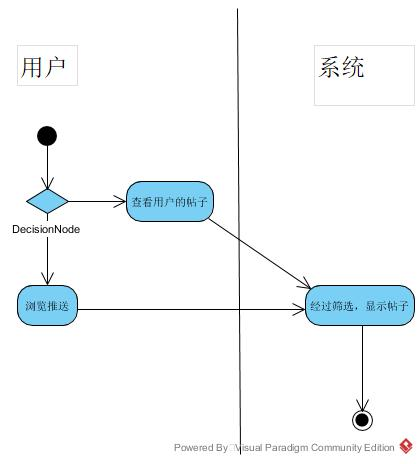
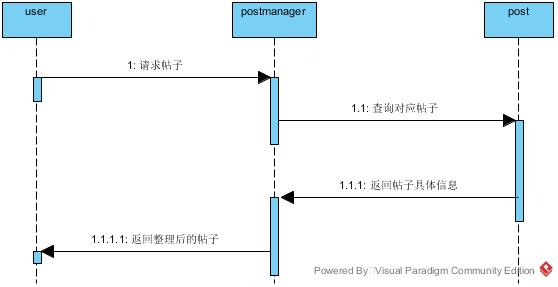
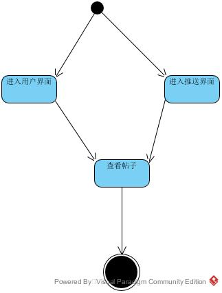
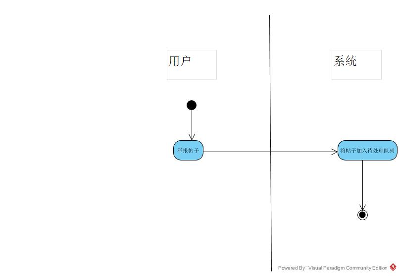
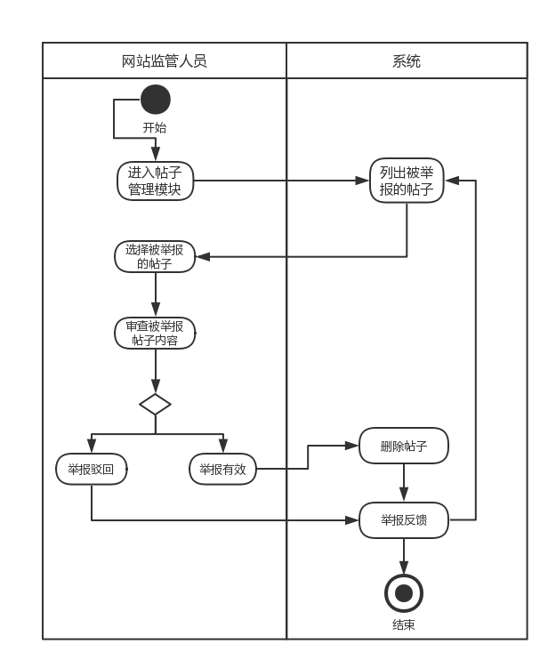

# 校园互动交友平台分析模型文档

# 南京大学软件学院2016级本科

## 目录

[TOC]

## 成员

| 钟镇鸿 PM | 161250212 |
| --------- | --------- |
| 肖云帆    | 161250161 |
| 谢寅鹏    | 161250162 |
| 熊以恒    | 161250163 |

## 文档修改时间

|  修改时间  | 修改人员 | 修改内容 |
| :--------: | :------: | :------: |
| 2018.11.02 |  钟镇鸿  | 初次建立 |
|            |          |          |
|            |          |          |
|            |          |          |

## 1. 概念类图

## 2. 用例图

## 3.详细用例说明

根据《用例文档》，对各用例进行面向对象分析建模后，结果如下

### 3.1 登录
#### 3.1.1 活动图

#### 3.1.2 顺序图

#### 3.1.3 状态图

### 3.2 查看帖子
#### 3.2.1 活动图

#### 3.2.2 顺序图

#### 3.2.3 状态图

### 3.3 关注管理
#### 3.3.1 活动图

#### 3.3.2 顺序图

#### 3.3.3 状态图

### 3.4 加入群组

#### 3.4.1 活动图

#### 3.4.2 顺序图

#### 3.4.3 状态图

### 3.5 修改个人信息

#### 3.5.1 活动图

#### 3.5.2 顺序图

#### 3.5.3 状态图

### 3.6 发布帖子

#### 3.6.1 活动图

#### 3.6.2 顺序图

#### 3.6.3 状态图

<h3>3.7 查看帖子</h3>
<h4>3.7.1 活动图<h4>
</img>
<h4>3.7.2 顺序图<h4>
</img>
<h4>3.7.3 状态图<h4>
</img>
<h3>3.8 举报帖子</h3>
<h4>3.8.1 活动图<h4>
</img>
<h4>3.8.2 顺序图<h4>
</img>
<h4>3.8.3 状态图<h4>
</img>
<h3>3.9 查看网站信息</h3>
<h4>3.9.1 活动图<h4>
</img>
<h4>3.9.2 顺序图<h4>
</img>
<h4>3.9.3 状态图<h4>
</img>

### 3.10 帖子管理

#### 3.10.1 活动图

#### 3.10.2 顺序图

#### 3.10.3 状态图

### 3.11 标签管理

#### 3.11.1 活动图

#### 3.11.2 顺序图

#### 3.11.3 状态图

